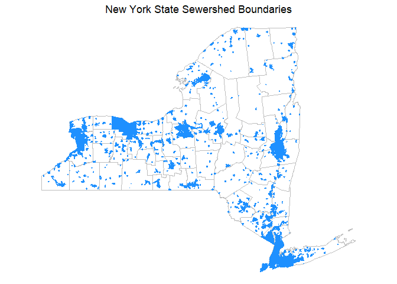

How to load spatial data and map NY sewersheds in R
================

### Introduction

New York State’s Sewersheds were mapped in 2021 as part of the effort to
bring wastewater surveillance to every county in the state. Full
methodology for how the boundaries were created are available at [this
link](https://doi.org/10.1371/journal.pgph.0001062). You can also
download a shapefile for use in other software at [ArcGIS
Online](https://www.arcgis.com/home/item.html?id=e795007660ae4a1fae5f86b40d065b3a).

The data in this GitHub repository is the most up-to-date version of
this data and is stored in CSV format to allow for use in many different
programs, including R. The R package used here for working with spatial
data is called [{sf}](https://r-spatial.github.io/sf/) which stands for
“simple features.”

The data file can be loaded using the following code:

``` r
# load packages
library(sf)
library(dplyr)
library(readr)
library(ggplot2)

# read in as spatial data in sf format
# assumes you have a copy of this file in your working directory
sewershed_sf = st_read('../nys-wws-sewersheds-polygons.csv')
```

You will notice that the data has three fields: `site_id`, the sewershed
unique identifier; and `WKT` and `geometry`, which contain the
coordinates for the vertices to draw the polygon in a spatial format.

``` r
names(sewershed_sf)
```

    ## [1] "cdc_id"   "sw_id"    "WKT"      "geometry"

Note that the file does not contain a coordinate reference system, so we
will add that before doing any mapping.

``` r
# set CRS
sewershed_sf = st_set_crs(sewershed_sf, "+proj=latlong +zone=10:14N +datum=WGS84 +units=km")
```

Now that our data is loaded and has a coordinate reference system and
projection, we can conduct any spatial analysis of interest or plot the
data on a map.

### Adding sewershed metadata

The sewershed spatial polygons do not have some of the important
metadata fields like county or population served, but we can add them
from the metadata file in the GitHub repo.

``` r
# add the metadata
# assumes you have a copy of this file in your working directory
sewershed_meta = readr::read_csv('../nys-wws-sewersheds.csv')

# merge with metadata
# joins naturally using site_id
sewershed_sf = left_join(sewershed_sf, sewershed_meta)
```

### Plotting the data

Let’s make a basic map that might be typical for presenting these data.
We will load county census boundaries to add some more detail to the
final map.

``` r
# we want to add the county boundaries to the plot,
# so we are going to download them from the US census via the {tigris} package
library(tigris)
ny_counties = counties(state = "NY", cb = TRUE) 
# cb = true specifies to use the cartographic boundary to show the coastline
```

The sewershed spatial data file includes all sewersheds including
upstream sites. We are going to plot the WWTP sites only. To do this,
filter the sf object for rows with `Method == "Influent"`.

Other Method categories include “manhole” and “pump station”. Rows with
`NA` for Method are upstream, unknown polygons.

``` r
influent_sewersheds = sewershed_sf %>%
  filter(method == "Influent")

ggplot()+
  geom_sf(data = ny_counties, fill = "white", color = "grey")+
  geom_sf(data = influent_sewersheds,
          fill = "dodgerblue",
          color = "dodgerblue")+
  theme_void()+
  labs(title = "New York State Sewershed Boundaries")+
  theme(plot.title = element_text(hjust = 0.5))
```

<!-- -->
